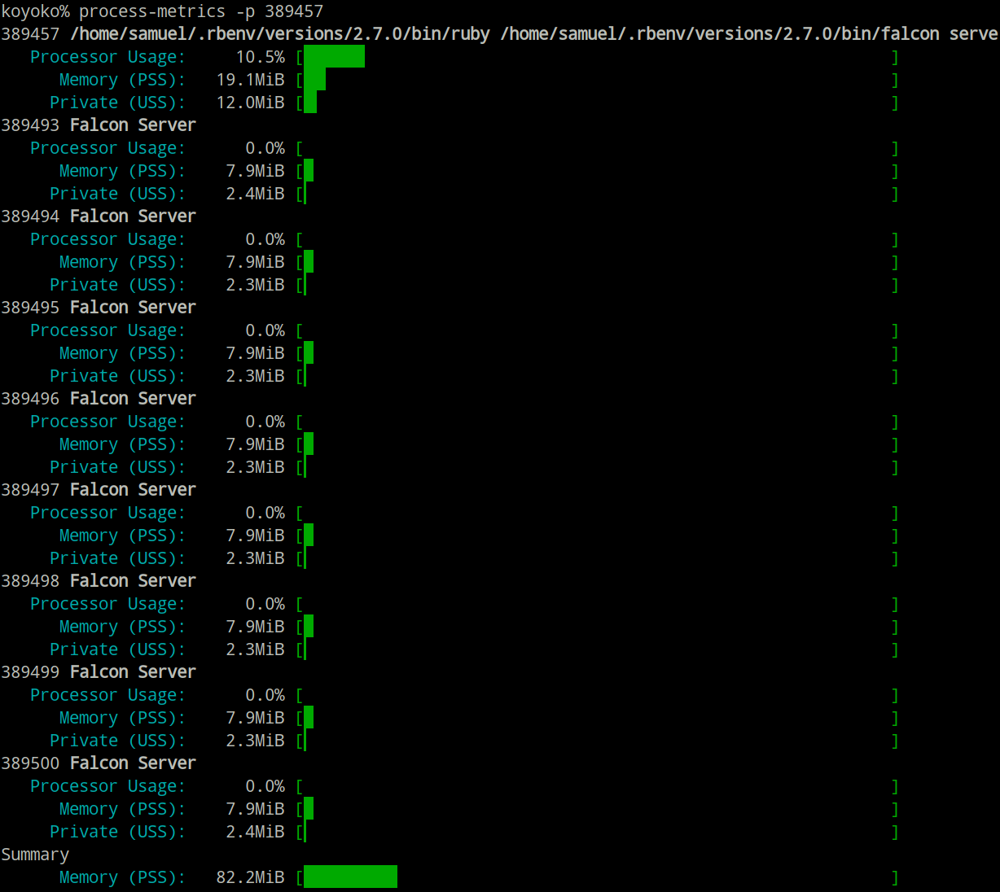

# Process::Metrics

Extract performance and memory metrics from running processes.

[](https://travis-ci.com/socketry/process-metrics)

## Installation

To add it to your current project:

	bundle add process-metrics

## Usage

Memory is measured in kilobytes and time is measured in seconds.

### Command Line

You can use the `process-metrics` command line to print data about a running process and it's children:



### Capturing for Specific Process

You can capture the metrics for a single process:

```ruby
#!/usr/bin/env ruby

require 'process/metrics'

metrics = Process::Metrics.capture(pid: Process.pid)

pp metrics
# [{:pid=>282195,
#   :ppid=>230572,
#   :pgid=>282195,
#   :pcpu=>0.0,
#   :time=>0,
#   :vsz=>78800,
#   :rss=>14360,
#   :etime=>0,
#   :command=>"ruby /tmp/6b35f421-4595-45d6-b444-754a50636daf",
#   :memory=>
#    {:total=>78804,
#     :rss=>14600,
#     :pss=>9208,
#     :shared_clean=>5728,
#     :shared_dirty=>0,
#     :private_clean=>16,
#     :private_dirty=>8856,
#     :referenced=>14600,
#     :anonymous=>8856,
#     :swap=>0,
#     :swap_pss=>0,
#     :maps=>150}}]
```

### Capturing for Process Hierarchy

You can capture the metrics for a process and all it's children:

```ruby
#!/usr/bin/env ruby

require 'process/metrics'

ppid = ENV["PPID"].to_i
metrics = Process::Metrics.capture(pid: ppid, ppid: ppid)

pp metrics
# [{:pid=>68536,
#   :ppid=>46295,
#   :pgid=>68536,
#   :pcpu=>0.0,
#   :time=>0,
#   :vsz=>94516,
#   :rss=>29688,
#   :etime=>41057,
#   :command=>
#    "/home/samuel/.rbenv/versions/2.7.0/bin/ruby /home/samuel/.rbenv/versions/2.7.0/bin/falcon-host ./falcon.rb",
#   :memory=>
#    {:total=>94520,
#     :rss=>29696,
#     :pss=>8912,
#     :shared_clean=>9528,
#     :shared_dirty=>14588,
#     :private_clean=>924,
#     :private_dirty=>4656,
#     :referenced=>29696,
#     :anonymous=>19244,
#     :swap=>0,
#     :swap_pss=>0,
#     :maps=>294}},
#  {:pid=>68558,
#   :ppid=>68536,
#   :pgid=>68558,
#   :pcpu=>0.0,
#   :time=>0,
#   :vsz=>94516,
#   :rss=>23612,
#   :etime=>41057,
#   :command=>"supervisor",
#   :memory=>
#    {:total=>94520,
#     :rss=>23612,
#     :pss=>7551,
#     :shared_clean=>4416,
#     :shared_dirty=>14448,
#     :private_clean=>0,
#     :private_dirty=>4748,
#     :referenced=>11184,
#     :anonymous=>19196,
#     :swap=>0,
#     :swap_pss=>0,
#     :maps=>294}},
#  {:pid=>68559,
#   :ppid=>68536,
#   :pgid=>68558,
#   :pcpu=>0.0,
#   :time=>0,
#   :vsz=>95000,
#   :rss=>25136,
#   :etime=>41057,
#   :command=>"Falcon Host for hello.localhost",
#   :memory=>
#    {:total=>95004,
#     :rss=>25136,
#     :pss=>9308,
#     :shared_clean=>5504,
#     :shared_dirty=>11784,
#     :private_clean=>0,
#     :private_dirty=>7848,
#     :referenced=>17596,
#     :anonymous=>19632,
#     :swap=>0,
#     :swap_pss=>0,
#     :maps=>295}},
# ... snip ...
```

### Metrics

On some platforms (currently only Linux), additional memory metrics are captured.

#### Proportional Set Size

The total private memory usage + shared memory usage divided by the number of processes sharing said data.

#### Unique Set Size

The total private memory usage.

## Contributing

1. Fork it
2. Create your feature branch (`git checkout -b my-new-feature`)
3. Commit your changes (`git commit -am 'Add some feature'`)
4. Push to the branch (`git push origin my-new-feature`)
5. Create new Pull Request

## License

Released under the MIT license.

Copyright, 2019, by [Samuel G. D. Williams](https://www.codeotaku.com).

Permission is hereby granted, free of charge, to any person obtaining a copy
of this software and associated documentation files (the "Software"), to deal
in the Software without restriction, including without limitation the rights
to use, copy, modify, merge, publish, distribute, sublicense, and/or sell
copies of the Software, and to permit persons to whom the Software is
furnished to do so, subject to the following conditions:

The above copyright notice and this permission notice shall be included in
all copies or substantial portions of the Software.

THE SOFTWARE IS PROVIDED "AS IS", WITHOUT WARRANTY OF ANY KIND, EXPRESS OR
IMPLIED, INCLUDING BUT NOT LIMITED TO THE WARRANTIES OF MERCHANTABILITY,
FITNESS FOR A PARTICULAR PURPOSE AND NONINFRINGEMENT. IN NO EVENT SHALL THE
AUTHORS OR COPYRIGHT HOLDERS BE LIABLE FOR ANY CLAIM, DAMAGES OR OTHER
LIABILITY, WHETHER IN AN ACTION OF CONTRACT, TORT OR OTHERWISE, ARISING FROM,
OUT OF OR IN CONNECTION WITH THE SOFTWARE OR THE USE OR OTHER DEALINGS IN
THE SOFTWARE.
