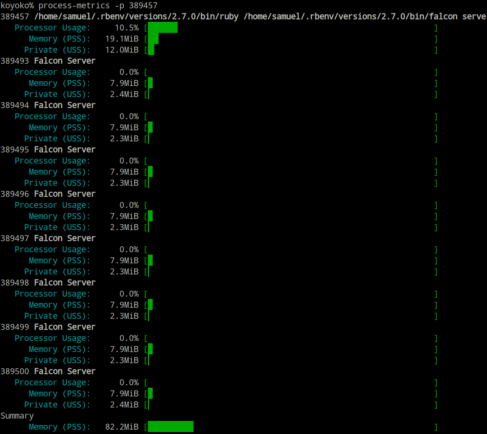

# Process::Metrics

Extract performance and memory metrics from running processes.



[](https://github.com/socketry/process-metrics/actions?workflow=Test)

## Usage

Please see the [project documentation](https://socketry.github.io/process-metrics/) for more details.

  - [Getting Started](https://socketry.github.io/process-metrics/guides/getting-started/index) - This guide explains how to use the `process-metrics` gem to collect and analyze process metrics including processor and memory utilization.

## Releases

Please see the [project releases](https://socketry.github.io/process-metrics/releases/index) for all releases.

### v0.14.0

  - Add `Process::Metrics::Processor.count` and `.quota` for affinity-aware processor counts and cgroup v2-aware processor capacity.

### v0.13.0

  - Normalize processor utilization to core units, where `1.0` represents one fully occupied CPU core, and restore Linux reporting.

### v0.12.0

  - Add `Process::Metrics::Processor` for measuring per-process CPU utilization over an interval.

### v0.11.0

  - `process-metrics` command is removed, replaced with `bake process:metrics`.

### v0.10.2

  - Add `Process::Metrics::Memory#private_size` for the sum of private (unshared) pages (Private\_Clean + Private\_Dirty); `#unique_size` is now an alias for `#private_size`.

### v0.10.1

  - Consistent use of `_size` suffix.

### v0.10.0

  - **Host::Memory**: New per-host struct `Process::Metrics::Host::Memory` with `total_size`, `used_size`, `free_size`, `swap_total_size`, `swap_used_size` (all bytes). Use `Host::Memory.capture` to get a snapshot; `.supported?` indicates platform support.

### v0.9.0

  - `Process::Metrics::Memory.total_size` takes into account cgroup limits.
  - On Linux, capturing faults is optional, controlled by `capture(faults: true/false)`.
  - Report all sizes in bytes for consistency.

### v0.8.0

  - Kill `ps` before waiting to avoid hanging when using the process-status backend.
  - Ignore `Errno::EACCES` when reading process information.
  - Cleaner process management for the `ps`-based capture path.

### v0.7.0

  - Be more proactive about returning nil if memory capture failed.

## Contributing

We welcome contributions to this project.

1.  Fork it.
2.  Create your feature branch (`git checkout -b my-new-feature`).
3.  Commit your changes (`git commit -am 'Add some feature'`).
4.  Push to the branch (`git push origin my-new-feature`).
5.  Create new Pull Request.

### Running Tests

To run the test suite:

``` shell
bundle exec sus
```

### Making Releases

To make a new release:

``` shell
bundle exec bake gem:release:patch # or minor or major
```

### Developer Certificate of Origin

In order to protect users of this project, we require all contributors to comply with the [Developer Certificate of Origin](https://developercertificate.org/). This ensures that all contributions are properly licensed and attributed.

### Community Guidelines

This project is best served by a collaborative and respectful environment. Treat each other professionally, respect differing viewpoints, and engage constructively. Harassment, discrimination, or harmful behavior is not tolerated. Communicate clearly, listen actively, and support one another. If any issues arise, please inform the project maintainers.
